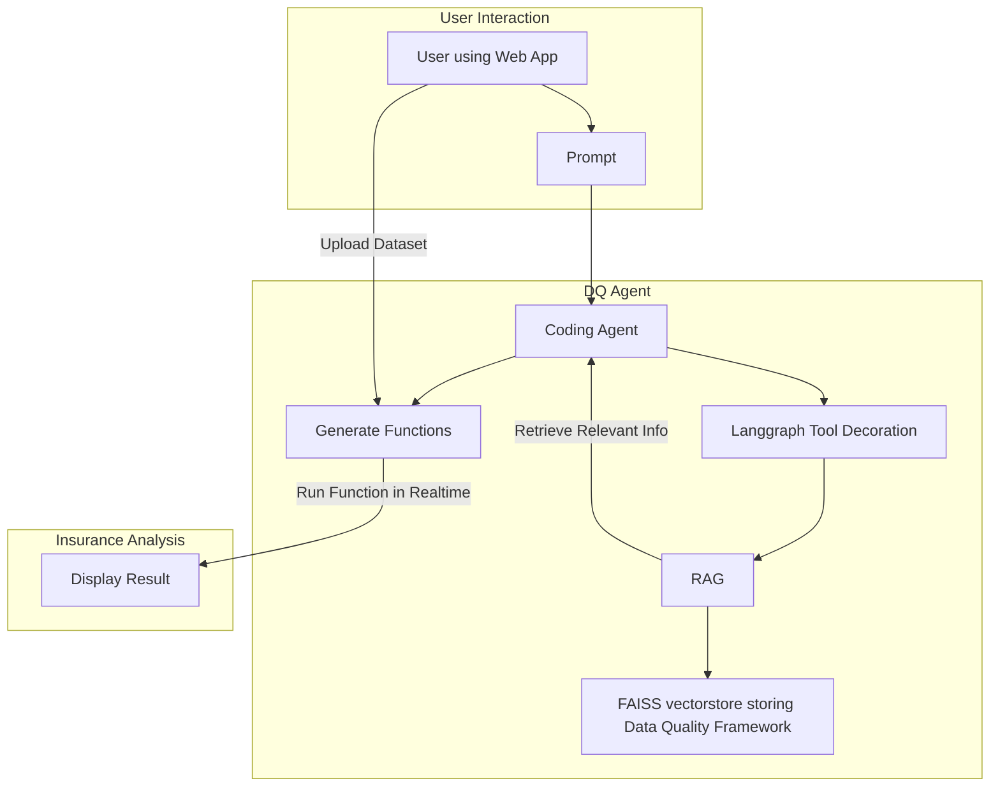

# Data Quality Coding Agent
Install required packages

## TO Run App:
```
streamlit run app.py
```



## To update vectorstore so Agent has more domain knowledge:

Use notebook Notebook_to_build_vectorstore