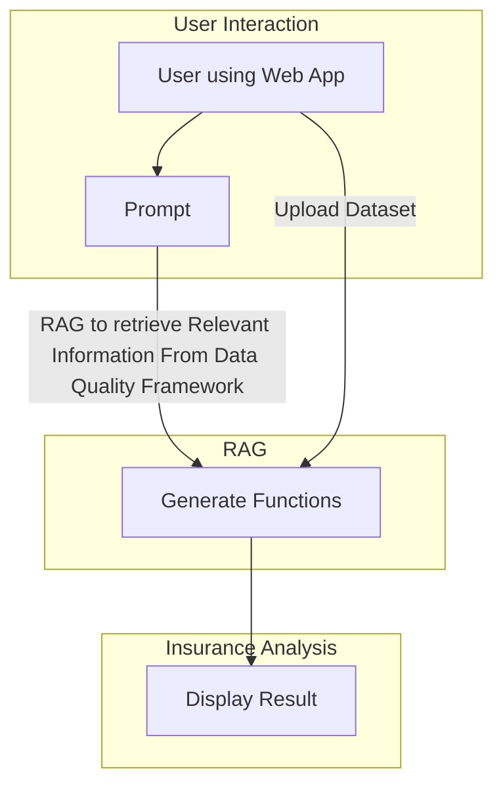

# Data Quality Coding Agent

```mermaid
graph TB

subgraph User Interaction
    A[User using Web App] --> D[Prompt]
end


subgraph RAG
    D -- "RAG to retrieve Relevant Information From Data Quality Framework" --> K[Generate Functions]
    
end

subgraph Insurance Analysis
    A -- "Upload Dataset" --> K[Generate Functions] --> M[Display Result]
    
end

```